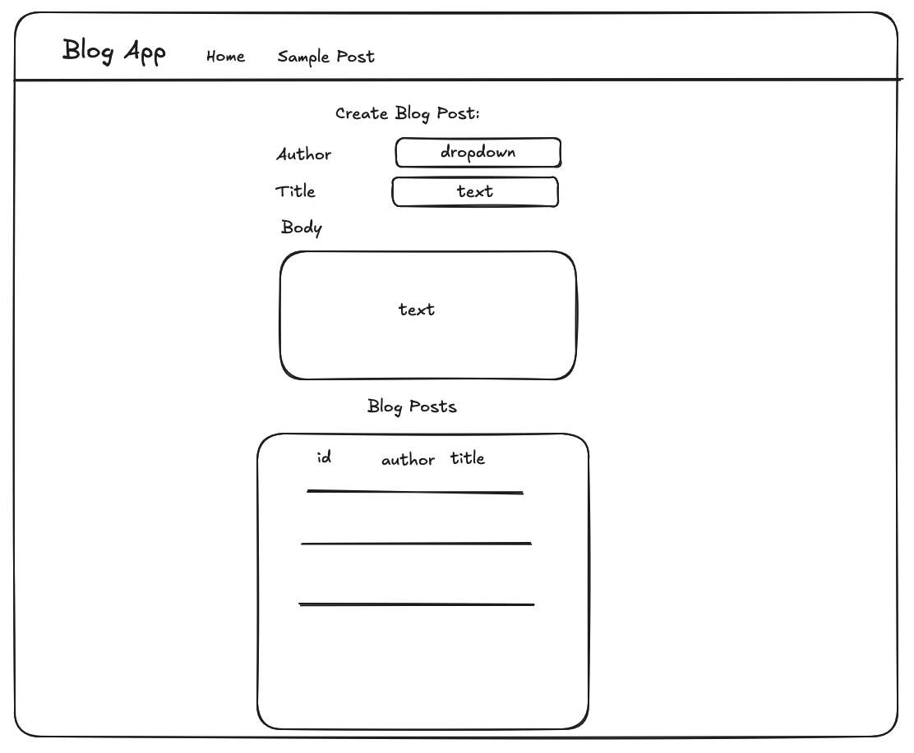

# Full-Stack Blog Application Project

This repository contains a full-stack blog application with a React frontend and three different Python backend implementations:
- Django
- Flask
- FastAPI

## Project Structure

- `fb-django/` - Django implementation
- `fb-flask/` - Flask implementation  
- `fb-fastapi/` - FastAPI implementation
- `fb-react-frontend/` - React frontend application

## Current State

- Each backend API already has an Author model and a creation endpoint (`POST /authors/`)
- The React frontend has a basic routing structure with a home page and empty post detail page
- The app currently allows creating authors

## UI Mockup

Below is a mockup of the desired UI for the application:



## Your Task

Choose one of the backend frameworks and implement a blog application following these steps:

### Step 1: Get Authors and Display Them in a Dropdown
- **Backend**: Create an endpoint to fetch all authors (`GET /authors/`)
- **Frontend**: Fetch authors from the API and display them in a dropdown

### Step 2: Create a Blog Post
- **Backend**: 
  - Create a BlogPost model with fields like title, content, author (reference to Author), etc.
  - Implement an endpoint to create blog posts (`POST /posts/`)
- **Frontend**: Create a form to submit new blog posts, using the author dropdown from Step 1

### Step 3: List Blog Posts
- **Backend**: Implement an endpoint to list all blog posts (`GET /posts/`)
- **Frontend**: Create a page or section to display all blog posts, with links to view details

### Step 4: View Blog Post Details
- **Backend**: Implement an endpoint to get a specific blog post by ID (`GET /posts/{id}/`)
- **Frontend**: Update the existing `/post/:id` route to fetch and display the actual blog post data

## Setup Instructions

### Backend Setup

1. Choose one of the frameworks (Django, Flask, or FastAPI)
2. Navigate to the corresponding directory:
   ```bash
   cd fb-django/    # or fb-flask/ or fb-fastapi/
   ```
3. Follow the framework-specific setup below
4. Implement the required models and endpoints

#### Django Setup
- Install dependencies: `pip install -r requirements.txt`
- Run migrations: `python manage.py migrate`
- Start server: `python manage.py runserver`

#### Flask Setup
- Install dependencies: `pip install -r requirements.txt`
- Start server: `python app.py`

#### FastAPI Setup
- Install dependencies: `pip install -r requirements.txt`
- Start server: `uvicorn main:app --reload`

### Frontend Setup

1. Navigate to the React frontend directory:
   ```bash
   cd fb-react-frontend
   ```
2. Install dependencies:
   ```bash
   yarn
   # or
   npm install
   ```
3. Start the development server:
   ```bash
   yarn dev
   # or
   npm run dev
   ```
4. The frontend is configured to connect to your backend via the `VITE_API_URL` in `.env`

## Framework-Specific Guidelines

### Django
- Use Django REST Framework
- Create appropriate serializers for your models

### Flask
- Use Flask-SQLAlchemy for your models
- Implement JSON responses for your API

### FastAPI
- Use SQLAlchemy for models and Pydantic for schemas
- Implement appropriate response models

## What We're Looking For

- Clean, well-organized code
- Proper API design and implementation
- Appropriate error handling
- Good understanding of the chosen framework
- Thoughtful model design
- Effective frontend-backend integration

## Stretch Goals

- Add more advanced querying options (filtering, sorting)
- Implement unit tests for your endpoints
- Add comments functionality to blog posts
